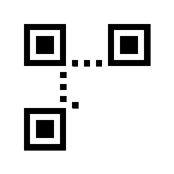
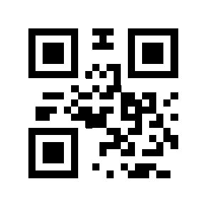
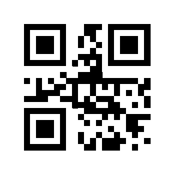
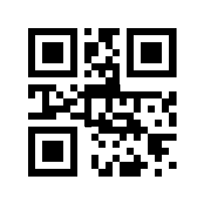
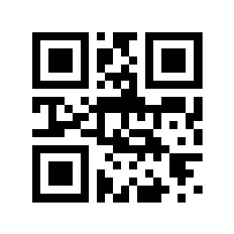

# QR Code Generator
This was university coursework for Programming in Python module.

## Description
This project aims to implement the creation of a QR code using Python. This QR code generator encodes an input text into a QR code matrix (numpy).
With support for:

- Versions 1 & 2 (auto detecting smallest version)
- Error Correction (level L)
- Byte Mode Encoding (ISO-8859-1)
- Mask Optimization (Penalty scoring using all masks)
- Numpy Matrix Handling

## Overview

### Data Analysis
A QR code encodes a string of text. This can be done with one of 4 standard modes: Numeric, Alphanumeric, Byte and Kanji
For this project a default `Byte Mode` has been used. However a brief description of each mode indicates:
- Alphanumeric Mode
- Numeric Mode
- Byte Mode
- Kanji Mode

### Data Encoding
A QR code needs to ensure that there is the shortest possible string of bits for the character string used for the mode selected (in this case byte)
Each mode has different methods of converting the input string, we will focus on Byte Mode:
1. Choosing Error Correction Level: we have chosen a default `ECC L`
2. Determining Smallest Version: smalles version that can contain string
3. Adding Character Count: for Byte Mode (`0100`) at start of encoded data
4. Adding Character Count: string character count (binary) after mode indicator
5. Encoding: encoding using Byte Mode
6. Padding: adding padding to match qr specification

### Error Correction
A QR code also needs to be able to be detected using readers so error correction is essential.
1. Using Reed-Solomon: polynomial long division for error correction
2. Generator Polynomial: generating generator polynomial
3. Polynomial Division: dividing message polynomial by generator polynomial

### Structuring Final Message
Since we are using smaller qr codes < Version 9, no interleaving required, so simply placing ecc after data codewords suffices.

### Module PLacement
1. QR code contains different function patterns including:
- Finder Patterns
- Seperators
- Alignment Patterns
- Timing Patterns
- Dark Module
- Reserved Areas for Format and Version Information
2. Placing Data Bits: in a specific pattern placing the final bit message into unreserved modules on qr code.

### Data Masking
Once having placed all the modules in the matrix, we determine the best mask pattern on a set of conditions and score.
Basic overview of the four penalty rules, penalty assigned for:
- each group of five or more same-coloured modules in a row / column
- each 2x2 area of same-coloured modules in matrix
- patterns that look similar to finder patterns
- if more than half of the modules are light or dark, larger difference larger penalty
For each masking 0-7, calculating score and picking mask with lowest penalty score

### Format and Version Information
1. Creating 5-bit format data
2. Generating 10-bit error correction bits
3. Combining and XORing
4. Placing format string in matrix

### Final
By following these steps and producing python code reproducing the same functionality we created 
a working qr code generator which can produce a qr code up to Version 2.

***

## Functionality and Operation
Functionality can be demonstrated in the demo below for the web implementation.
Set up information can be found inside of code directory `QR_Code`.

## Programming Paradigms

**Imperative Programming**

imperative programming by definition focuses on step-by-step execution with explicit state changes.
Key uses of loops and conditionals:
- matrix.py's place_data_bits() function uses nested loops in order to traverse the QR matrix.
- masking.py's apply_mask() checks conditions for each module inversion.
            
Key uses of Stateful Operations

- app.py's generate() modifies best_matrix in-place.
- patterns.py's place_matrix_in_positions() updates the reversed matrix

**Functional Programming**

Functional programming emphasizes pure functions, immutability, and higher-order Operations
Here were some of the key uses of pure functions within the project:

- encoding.py's split_bit_string() and bits_to_bytes() are free of any side effects
- masking.py's penalty rules (penalty_rule1(), etc) compute values without mutation

Here are some of the key uses of Higher-order functions within the project:
- app.py uses min() with a lambda to select the best mask:

`best = min(..., key=lambda x: x[2])`

- list comprehensions in encoding.py:

`[int(bit) for bit in bit_string]`

immutability is emphasizesed in the data flow in encoding.py, generate_codewords() allows data flow through a series of pure functions, without moddifying the original input data

**object-oriented programming**

The object oriented approach organizes code into objects with encapsulated state and behavior
It was not used often in the project since we deemed that a functional approach would be more suited, however it still saw some key usage in various parts:

app.py

- The app object `Flask(__name__)` uses OOP for routing - `@app.route`
- HTTP request handling was also encapsulated with `request.form.get()`

Use of Pillow showcased OOP-style method calls:
- `image.new()`
- `img.save()`

| file                   | imperative         |  functional                 | OOP               | 
| ---------------------- | ------------------ |-----------------------------|-------------------|
| ` app.py`              |  routes,loops      | `min()/lambda`              | Flask `app`       |
|  `encoding.py`         |   loops            | pure functions, `join()`    | `reedsolo` lib    |
|  `matrix.py`           |   nested loops     |  n/a                        |  n/a              |
|   `masking.py`         |  conditionals      |  pure penalty rules         |  n/a              |
|   `patterns.py`        |   state updates    |  n/a                        |  n/a              |
|    `image_utils.py`    |   n/a              |  n/a                        |  `PIL.image`      |

## Social, Legal, Ethical
A summary of how social (e.g., accessibility, inclusivity, education), 
legal (e.g., data protection), and ethical (e.g., transparency, risk 
mitigation) concepts have been addressed in this work. 

**Social Considerations**

Input validation:

To ensure accessibility and inclusivity, we had to make sure that the text was encoded such that it was compatible with standard QR scanners, avoiding garbled characters for users. Input length is also limited to prevent failures in rendering.

education:

- the docstring in `main.py` explains the QR versions and capacities, allowing developers to understand constraints
- the warning in the web UI (`INDEX_HTML`) educates users about malicious QR risks

image generation:
- `image_utils.py` adds a white border and scales pixels for better scanner readability

**Legal Considerations**

Data protection:

- There is not any reason for data to be stored since the Flask app processes inputs transiently. This mitigates GDPR risks
- The inputs are sanitized such that all non-iso-8859-1 characters are rejected, preventing users from encoding exploits.

Compliance:

- The web UI warns users about phishing risks, protecting us legally from misuse

**Ethical Considerations**

transparency:

- `masking.py` openly documents penalty rules for mask selection, ensuring fairness in QR optimization.
- Error handling within the code ensures that we are able to return clear error messages to the user to guide them in an ethical manor

Risk mitigation:

- The same points about mitigating malicious use by warning against scanning untrusted QR codes, and also limiting exploits in input
- the reedsolo error correction in `encoding.py` ensures data recovery is robust, reducing bais in scanning damaged codes.

## Weaknesses and Flaws
Outline the specific weaknesses and flaws in your application. For 
example, is it susceptible to misuse or potentially unsafe?  How? 

**Technical Weaknesses**

Error Handling:

- Unsupported characters in encoding.py only raise error for `iso-8859-1` which can cause silent faliures. This means in some cases users might not understand why inputs fail

Performance:

- in `masking.py`, the masking algorithm tries all 8 masks sequentially, which is inefficient for larger QR versions

Dependancy risks:

- The code relies on `reedsolo` for error correction without pinning a library version, this potentially risks breaks from updates.

**Security and misuse vulnerabilties**

malicious code generation:

- The app can encode any text without content validation. This means the user could generate a QR code linking to a phishing link, which could be used to exploit people.

injection attacks:

- The flask web interface `app.py` lacks input sanitisation for cross-site scripting, if the template rendered the user input in a way thats unsafe
- shell commands could potentially be used to generate images, which would be dangerous for users

data leakage:

- while there is no data technically stored, the web app could log inputs unitntentionally via the server logs, meaning that data could be leaked.

**legal risks**

copyright violations:

- if a user uses the application to encode copyrighted content, the app unknowingly facilitates infringement

privacy:

- There is no explicit privicy policy, which would be required under the GDPR if deployed publicaly

**Ethical and social flaws**

accessibility gaps:

- The web UI lacks alt text for the QR image, meaning that those who require screen reading software cannot read it
- There are no contrast checks for the generated QR code, this could make it difficult for users who have worse vision

transparency:

- There is no disclaimer detailing the intended use of the software (e.g. "for educational purposes only")

## Modelling
Explain how you have modelled information, managed user inputs

**Information Modelling**

Data representation:

- The core data structure is a 2D List, for instance `matrix` in `matrix.py`, where 1 is a black module and 0 is a white module

`matrix = [[None]*size for _ in range(size)]  # Initializes empty matrix`

Bistreams

- User input are converted to binary strings:

`data_bits = ''.join(format(b, '08b') for b in byte_data)  # "Hello" → "0100100001100101..."`

Codewords

- data and error correction bytes are stored as `list[int]` (e.g. `data_codewords` in `encoding.py`)

**User Input Management**

Input validation:

- text is encoded to ensure that it is compatible with ISO-8859-1
- The length of the input is checked to enforce version-specific limits

Input Transformation:

- Step 1: byte encoding

`byte_data = data.encode('iso-8859-1')  # Text → Bytes`

- Step 2: bitstream generation

`data_bits = ''.join(format(b, '08b') for b in byte_data)  # Bytes → Binary string`

- Step 3: Padding

`bit_string += '0' * terminator_len  # From add_terminator_and_padding()`

- Step 4: Error Correction

`rs = reedsolo.RSCodec(ecc_count)`

`full = list(rs.encode(bytearray(data_bytes)))  # Adds ECC`

Web input handling:

- Extracts the users input safely using `request.form.get('text', '')`
- uses flask's auto escaping to safely render user controlled data

**Error Handling**

| scenario | response |  code reference    |
| ------ | ------ |------|
|Invalid characters.   |Returns error message            |`app.py` unicodeEncodeError catch|
|Input too long.       |Rejects with clear feedback      |`app.py` length check            |
|Unsupported QR version|raises ValueError                |`matrix.py` initialize_matrix(). |
|Masking Errors.       |Silent fail (matrix is unchanged)|`masking.py` apply_mask().       |

## Real World application
Describe the features of your application that would make it suitable 
for use in support of real-world functions (e.g., marketing, inventory, 
science, tracking). 

**marketing and advertising**

- The custom content encoding would be suitible for embedding URLs, promo codes, or contact details
- the web interface is easy for non-technical users to generate codes to use

To make this a reality, it would be wise to invest in some branding, perhaps adding logos or colours to the QR codes.

**Inventory and supply chain**

- you could use the application to encode product IDs by storing serial numbers as compact QR codes.
- The error correction features of the code (reedsolo) ensure that the labels would be scannable even if they were damaged

It would be a good idea to include some integration into a database so that we would be able to link to some kind of inventory system

**Attendance and access Control**

- use the application to generate unique time-limited access tokens for events
- mask optimization in `masking.py` ensures that the scanning is consistant

We would have to integrate some sort of encryption system so that valuable limited time tokens were protected

**Logistics and shipping**

- use the application to encode tracking numbers or routing details, allowing for parcel tracking
- the QR codes are resistant to damage due to the high level of error correction

All that would have to be done to achieve this is to conform to the industry standard formats, making this probably the easiest real world implementation of the application that I have considered

## Testing and Deploying
Test string: `Hello World`
Using Version: `1` and ECC: `L` and Mode: `Byte`

### Web Implementation Demo

### Steps of QR Code creation
#### Bit Patterns

#### Data Bits

#### Applying Mask

#### Format Info Bits

#### Final QR Code

***

## Authors and acknowledgment
Joao Sousa, Jonathan Cronin, Gabriel Dorosh

Sources used include: 
[QR Code Tutorial - Thonky](https://www.thonky.com/qr-code-tutorial/)
